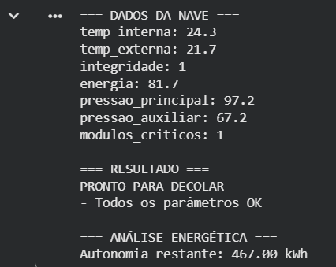
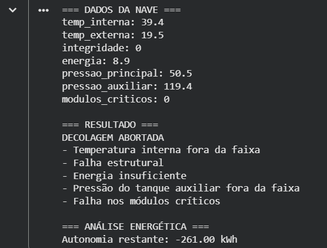

# Projeto Nave Espacial — Sistema de Telemetria para Decolagem

Este projeto apresenta o desenvolvimento de um sistema computacional para simulação de tomada de decisão em uma nave espacial, com base na análise de parâmetros de telemetria. O propósito central é verificar, por meio de regras predefinidas, se a nave se encontra em condições seguras para decolagem ou se a operação deve ser abortada.

---

## Objetivo

O objetivo deste trabalho é implementar um sistema capaz de analisar variáveis críticas de operação de uma nave espacial e, a partir delas, emitir uma decisão automatizada quanto à autorização de decolagem.

Além da lógica principal de verificação, o projeto contempla uma análise energética, uma análise assistida por inteligência artificial e uma reflexão crítica sobre aspectos éticos, sociais e sustentáveis relacionados à automação em sistemas espaciais.

---

## Parâmetros analisados

O sistema considera os seguintes parâmetros de telemetria:

- Temperatura interna  
- Temperatura externa  
- Integridade estrutural  
- Nível de energia  
- Pressão do tanque principal  
- Pressão do tanque auxiliar  
- Status dos módulos críticos  

Cada um desses elementos representa uma condição relevante para a segurança e a viabilidade da decolagem.

---

## Funcionamento do sistema

O programa realiza a leitura ou simulação dos dados da nave, verifica se os valores estão dentro de faixas consideradas seguras e, com base nisso, determina o resultado final.

Caso qualquer variável esteja fora do intervalo estabelecido, a decolagem é abortada. Se todas as condições forem atendidas, o sistema informa que a nave está pronta para decolar.

---

## Análise energética

O sistema inclui uma etapa de análise energética com o objetivo de estimar a autonomia inicial da nave com base na capacidade total, na carga atual, no consumo estimado durante a decolagem e nas perdas energéticas.

A formulação utilizada é:

Energia disponível = Capacidade total × (Carga atual / 100)  
Autonomia = Energia disponível - Consumo de decolagem - Perdas energéticas  

Essa verificação complementa a lógica de decisão ao avaliar não apenas as condições físicas da nave, mas também a disponibilidade de recursos para a execução da missão.

---

## Exemplos de execução

Os exemplos abaixo ilustram dois cenários distintos gerados pelo sistema.

### Decolagem autorizada



### Decolagem abortada



---

## Análise assistida por inteligência artificial

A etapa de análise assistida por inteligência artificial foi incorporada com a finalidade de classificar os dados, identificar possíveis anomalias e sugerir riscos operacionais.

Essa abordagem complementa a verificação baseada em regras, contribuindo para uma avaliação mais ampla do estado da nave e reforçando a importância de sistemas auxiliares de apoio à decisão.

---

## Reflexão crítica

O projeto também contempla uma reflexão sobre a utilização de sistemas automatizados em contextos de alto risco. Em operações espaciais, decisões incorretas podem gerar consequências severas, incluindo perdas humanas, danos materiais e prejuízos científicos e financeiros.

Além disso, a exploração espacial possui impacto social significativo, pois impulsiona o desenvolvimento tecnológico e científico, ao mesmo tempo em que suscita discussões sobre custos, prioridades e acesso aos benefícios gerados.

Por fim, a sustentabilidade tecnológica deve ser considerada, especialmente no que se refere ao uso eficiente de recursos e à redução de impactos ambientais associados às atividades espaciais.

---

## Dependências

O projeto utiliza apenas bibliotecas padrão do Python:

- random

---

## Estrutura do projeto

```text
projeto-nave-espacial/
├── docs/
│   ├── relatorio.tex
│   ├── relatorio.pdf
│   └── images/
│       ├── pronto_para_decolar.png
│       └── decolagem_abortada.png
├── src/
│   └── main.py
├── nave_espacial.ipynb
└── README.md
```

---

## Como executar

### No notebook

1. Abrir o arquivo `nave_espacial.ipynb`  
2. Executar as células em ordem  
3. Observar a saída apresentada  

### No script Python

1. Abrir o terminal na pasta do projeto  
2. Executar o comando:

```bash
python src/main.py
```
